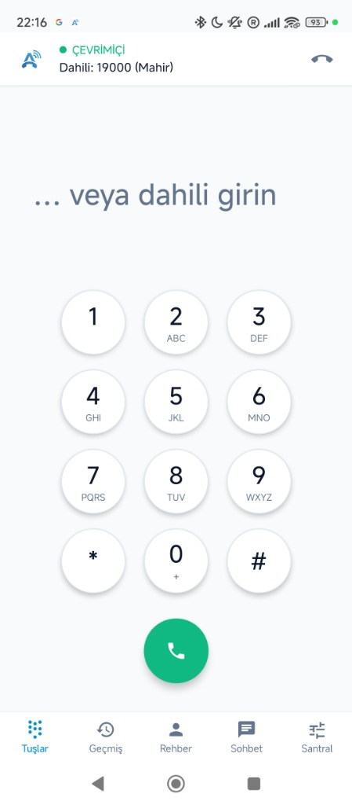
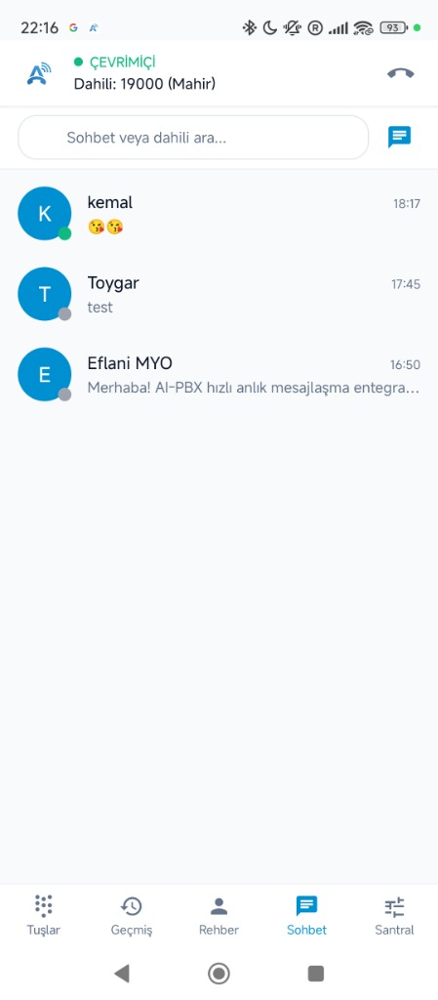
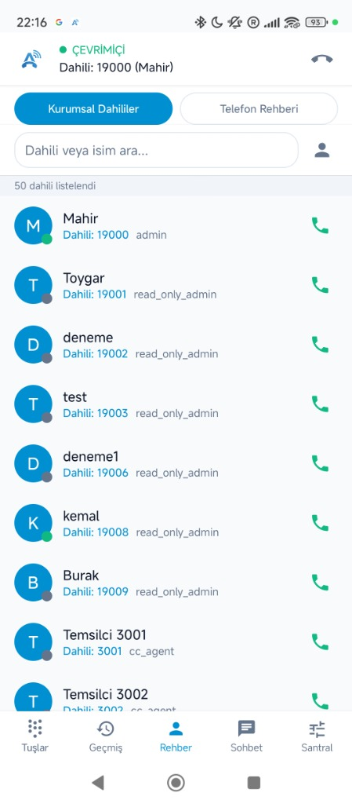
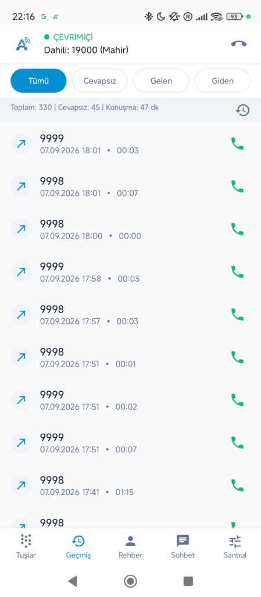
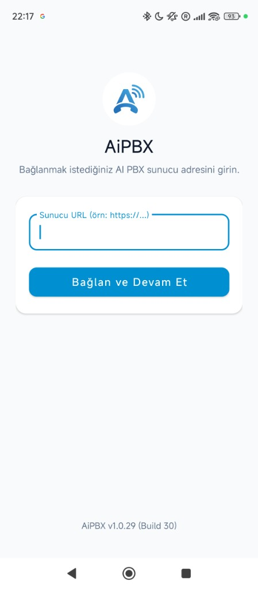

<p align="center">
  <a href="https://aipbx.bid">
    
  </a>
</p>

<h1 align="center">AI PBX</h1>

<p align="center">
  <strong>Open-Source Enterprise IP PBX Management Portal & Unified Communications</strong><br>
  Asterisk 22 · PHP 8 · MariaDB · WebRTC · Instant Messaging · Android & iOS Apps
</p>

<p align="center">
  <a href="https://aipbx.bid">🌐 <strong>Official Website & Documentation: aipbx.bid</strong></a>
</p>

<p align="center">
  <a href="https://github.com/mahirgul/AiPBX/blob/main/LICENSE"></a>
  
  
  
  
  
  <a href="https://aipbx.bid"></a>
  <a href="https://aipbx.bid"></a>
</p>

<p align="center">
  <a href="#quick-install">Quick Install</a> •
  <a href="#features">Features</a> •
  <a href="#architecture">Architecture</a> •
  <a href="https://aipbx.bid">Website</a> •
  <a href="#contributing">Contributing</a>
</p>

---

## Quick Install

```bash
# Clone the repository
git clone https://github.com/mahirgul/AiPBX.git /opt/aipbx
cd /opt/aipbx

# Run the installer as root
sudo bash install.sh
```

The installer will:
1. Ask for your **FQDN** (domain name) — or use your IP with a self-signed cert
2. Generate **strong random passwords** for all services automatically
3. Install and configure everything (Asterisk, MariaDB, Apache2, coturn, Chat service)
4. Display all credentials at the end and save them to `/root/aipbx-credentials.txt`

> **Requirements**: Ubuntu 26.04 LTS · 2 GB RAM · 10 GB disk · root access

After install, open `https://<your-server>` in your browser and log in with the credentials shown.

---

## Features

### 📞 PBX Management
- **Extension management** — PJSIP-based, dual-endpoint (SIP + WebRTC)
- **Trunk management** — dynamic PJSIP trunk configuration
- **Call routing** — DID mapping, outbound routes, time conditions
- **IVR** — multi-level voice menus with time-based routing
- **Queue management** — call queues, dynamic agent login/logout, hold music
- **Feature codes** — `*81` queue login (all or `*81<queue>`), `*80` queue logout, `*72` call forward, `*60` DND, `*43` intercom, `*88` spy/whisper
- **In-band disconnect supervision** — cadence-based disconnect tone detection (`from-trunk-kapanma-tonu`) for analog/legacy trunks without out-of-band hangup signaling
- **Auto-rollback** — failed Asterisk reloads are automatically reverted

### 📠 Fax System
- **Inbound/outbound fax** — T.38 and G.711 (res_fax + SpanDSP)
- **WYSIWYG fax editor** — compose rich-text faxes directly in the browser
- **PDF upload & send**
- **Fax retry**
- **Email notification** — incoming faxes forwarded by email automatically

### 📊 Call Center
- **Real-time agent panel** — live queue status, active calls, agent break selector
- **Dynamic queue login/logout** — via star codes (`*81`/`*80`) with audio confirmation (`queue-agentlogin-success` / beeps) or web UI
- **Intelligent call transfer** — bridge-traversal caller preservation (`findCallerChannelForAgent`) prevents dropped lines during attended transfer
- **Auto-desk navigation** — answering incoming queue calls in WebRTC automatically shifts SPA view to agent CRM/notes (`/cc-agent`)
- **CDR reporting** — detailed call records, filtering, export
- **Call recording playback** — listen to recordings in the browser

### 🌐 WebRTC Softphone
- **In-browser SIP phone** — zero-install browser phone embedded directly in topbar
- **Resilient TURN/STUN** — 30-minute automatic credential renewal eliminates silent audio on extended shifts
- **Opus + DTLS-SRTP** — high-quality, end-to-end encrypted audio

### 💬 Real-Time Messaging & Group Chat
- **1-to-1 & Multi-user Group Rooms** — Real-time team messaging powered by high-performance Go WebSocket daemon (`aipbx-chat`)
- **Rich Group Management** — Create groups, assign admin roles, invite/remove participants (up to 256 members per group)
- **Media & File Sharing** — Image compression, thumbnail generation, and secure attachment delivery
- **System Audit Trail** — System-generated messages for member additions, removals, and role updates
- **Presence & Delivery Receipts** — Real-time typing indicators, read receipts, and online status tracking
- **FCM Push Notifications** — Background notifications with conversation grouping for both direct and group messages

### 💼 Microsoft Teams Integration
- **Direct Routing (SBC / SIP TLS 5061)** — Native connection to Microsoft Phone System with TLS mutual authentication and SRTP
- **User & Extension Mapping** — Link PBX extensions with Microsoft 365 UPNs and E.164 phone numbers
- **Incoming Webhooks & Adaptive Cards** — Real-time Teams channel notifications for missed calls, voicemails, queue alarms, and incoming faxes
- **Dynamic M365 PowerShell Generator** — Ready-to-execute PowerShell setup scripts generated dynamically from your PBX configuration

### 📱 Android App (Build 33 · v1.0.32)
- **Native Kotlin** application with zero external cloud dependencies
- **PJSIP + WebRTC** dual engine with Opus HD audio & DTLS-SRTP encryption
- **FCM Push & Persistent Foreground Service** — instantaneous wake-up for incoming calls
- **Full Group Chat & Instant Messaging** — Direct 1-to-1 messaging, multi-user group chat rooms, quick group creation (`+ Yeni Grup`), conversation filter chips (All, Direct, Groups), participant management, admin roles, and real-time WebSocket updates
- **Corporate Directory & Live Presence** — 50+ extensions with live status & 1-tap dialing
- **Detailed Call History & In-App Log Viewer** — full diagnostics and call filtering
- **Available on Google Play Console** — automated Closed Testing track pipeline and direct signed APK downloads

### 🍎 iOS App (SwiftUI & CallKit)
- **Native SwiftUI** modern application for iPhone & iPad (iOS 16.0+)
- **Embedded WebRTC Voice Engine** with zero external cloud dependencies
- **CallKit & AudioSession Integration** — Native iOS lock-screen incoming calls, audio routing, speaker and mute
- **Full Group Chat & Direct Messaging** — Instant messaging, multi-party group rooms, contact picker, and real-time WebSocket communication
- **Corporate Directory & Live Presence** — 50+ extensions with live presence indicators and 1-tap call/chat
- **PBX Features & In-App Diagnostics** — DND, Call Forwarding, live log viewer, and log sharing via iOS ShareSheet
- **Automated GitHub Actions CI/CD** — compiled automatically on macOS runners into unsigned `.ipa` and Simulator `.zip` artifacts

### 📲 Mobile-First Web Management Portal
- **WhatsApp/Telegram-Style Master-Detail Chat** — Fluid responsive navigation on smartphones (`<= 768px`) with hardware/browser back-button popstate support
- **Optimized Mobile Views** — Touch-friendly responsive layouts for My Phone (`/my_phone`), Role Permission Matrix (`/roles`), Mobile Push Settings (`/push-settings`), and Pending Sync (`/pending-sync`)

<p align="center">
  
  
  
  
  
</p>

### ⚡ Ingress & Reverse Proxy (Nginx & Apache)
- **High-concurrency Nginx support** — event-driven WebSocket multiplexer, TLS 1.3, PHP-FPM FastCGI
- **Native Apache 2.4 support** — `mod_proxy_wstunnel` and `.htaccess` compatibility
- **Unified Port 443** — multiplexes Asterisk WebRTC SIP (`/ws`) and Go Chat (`/chat/ws`)
- **Ready-to-use Nginx template** — available in `conf/nginx/aipbx.conf.example`

### 🔐 Two-Factor Authentication (2FA) & Passkeys (WebAuthn / FIDO2)
- **Authenticator App Support (TOTP / RFC 6238)** — Compatible with Google Authenticator, Microsoft Authenticator, 1Password, Apple Passwords/Keychain, Authy, etc.
- **100% Offline & Private QR Codes** — Embedded native SVG QR code generator runs entirely on-premise without external third-party CDN or Google Chart dependencies (ideal for air-gapped PBX intranets).
- **Single-Use Backup Recovery Codes** — Generates 8 cryptographically hashed emergency recovery codes (`XXXX-XXXX`) with instant clipboard copy and `.txt` file export.
- **FIDO2 / WebAuthn Passkeys** — One-click passwordless and biometric authentication using Apple Touch ID / Face ID, Windows Hello, Android Biometrics, or hardware security keys (YubiKey, SoloKey).
- **Two-Step Login Flow (`/login-2fa`)** — Automatic redirection upon password verification with clock drift tolerance ($\pm 30$ seconds) and recovery code fallback.
- **Direct Passkey Login Button** — Log in with a single tap directly from the login page without entering passwords.
- **Self-Service Security Center (`/security`)** — Accessible from the footer profile menu for every authenticated user to manage 2FA, register/delete passkeys, and change passwords.
- **Admin Emergency 2FA Reset** — Dedicated 2FA status indicator and instant reset button in System Users (`/system-users`) if an employee loses their device.

### 🔒 Security
- **Optional Multi-Factor & Passkeys** — Hardware-grade FIDO2 / WebAuthn passkeys and RFC 6238 TOTP authenticators.
- **Granular RBAC** — modular role-permission matrix (`sys_role_permissions`) with strict read-only viewer mode, including `my_phone` and `chat` controls.
- **Math CAPTCHA** + brute-force lockout (5 failures → 15-min IP ban).
- **CSRF protection** — token on every POST form.
- **fail2ban integration** & **Firewall management** — control firewalld and fail2ban directly from the web UI.
- **Credentials served via API** — never embedded in page source.

### 🌍 Multi-language
- Turkish 🇹🇷 and English 🇬🇧 (1,740+ translation keys with 100% parity)
- Easy to extend with the `t()` function

---

## Architecture

```
AiPBX/
├── conf/                   # Nginx & web server production templates
│   └── nginx/aipbx.conf.example
│
├── web/                    # PHP MVC Web Portal
│   ├── src/
│   │   ├── controllers/    # 37 page controllers
│   │   ├── services/       # 26 business logic services
│   │   ├── repositories/   # 28 database repositories
│   │   └── sync/           # 13 Asterisk config generators
│   ├── templates/views/    # 36 PHP view templates
│   ├── api/                # REST API layer (WebAuthn, call control, WebRTC creds)
│   ├── assets/             # CSS, JS, fonts
│   ├── lang/               # Language files (tr/en - 1,740+ keys)
│   └── db/migrations/      # Phinx database migrations
│
├── android/                # Kotlin Android App
│   └── app/src/main/
│       └── java/com/mhrgl/aipbx/
│
├── ios/                    # Swift & SwiftUI iOS App (GitHub Actions CI/CD)
│   ├── AiPBX/              # App, Models, Services, Views, Resources
│   └── AiPBX.xcodeproj/    # Xcode project & schemes
│
├── chat/                   # Go WebSocket Chat Service
│   ├── main.go
│   ├── hub.go              # WebSocket hub
│   ├── handlers.go         # HTTP/WS handlers
│   └── db.go               # Database layer
│
├── asterisk-config/        # Asterisk reference configuration
│   └── pbx/                # Modular dialplan, PJSIP, queue files
│
├── db/                     # Database schema
│   ├── schema.sql          # Table definitions
│   └── seed.sql            # Initial seed data
│
├── install.sh              # One-command installer
└── README.md
```

### Technology Stack

| Layer | Technology |
|-------|-----------|
| PBX | Asterisk 22 (PJSIP, res_fax, AMI, ODBC) |
| Web Backend | PHP 8.x, strict MVC, Composer |
| Web Frontend | Vanilla JS + CSS (no framework) |
| Database | MariaDB (Phinx migrations) |
| Chat | Go + gorilla/websocket |
| Android | Kotlin, PJSIP, WebRTC, FCM |
| iOS | Swift 5.9, SwiftUI, WebKit, CallKit, Combine |
| WebRTC | coturn TURN/STUN, DTLS-SRTP, Opus |
| Security | WebAuthn (FIDO2 / Passkeys), TOTP 2FA, fail2ban, RBAC, CSRF, CAPTCHA |

---

## Post-Install

All credentials (admin password, DB passwords, AMI key, TURN secret) are generated randomly during install and saved to `/root/aipbx-credentials.txt`.

You can change all passwords later from **Admin Panel → Settings → System**.

To add a real TLS certificate after install (if you skipped Let's Encrypt):
```bash
certbot --apache -d your-domain.com
```

---

## Contributing

Contributions are welcome! Please check out our [Contributing Guidelines](CONTRIBUTING.md) for details on code style, commit conventions, and sandbox testing.

1. Fork the repository
2. Create a feature branch (`git checkout -b feat/my-feature`)
3. Commit your changes (`git commit -m 'feat: add awesome feature'`)
4. Push to the branch (`git push origin feat/my-feature`)
5. Open a Pull Request

---

## License

This project is licensed under the [MIT License](LICENSE).

---

## Author & Creator

**Mahir Gül** · [mhrgl.com](https://mhrgl.com) · [@mahirgul](https://github.com/mahirgul)

