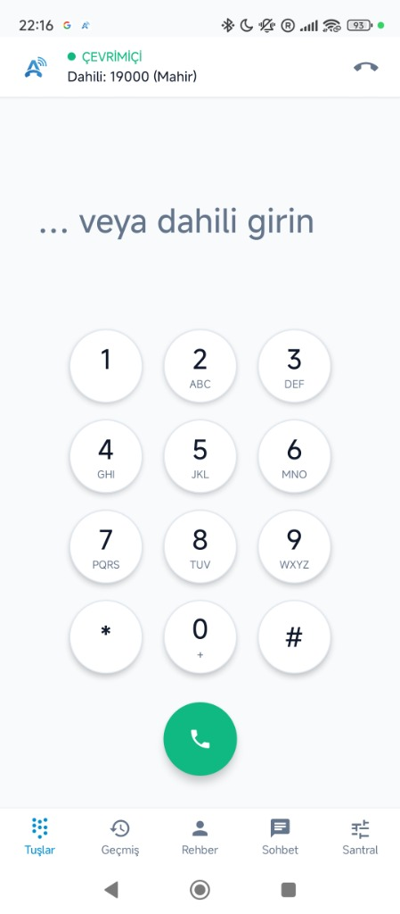
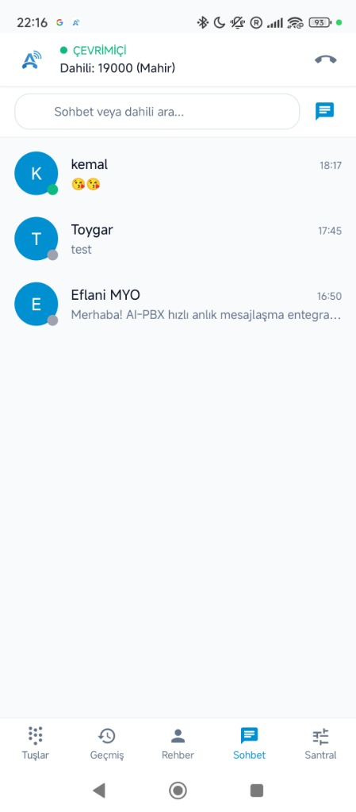
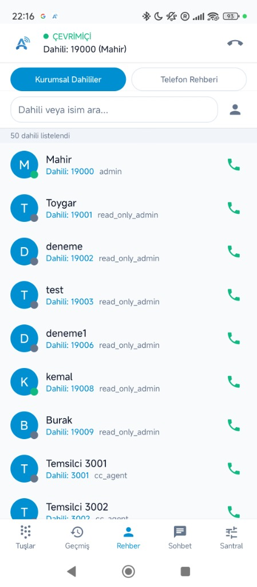
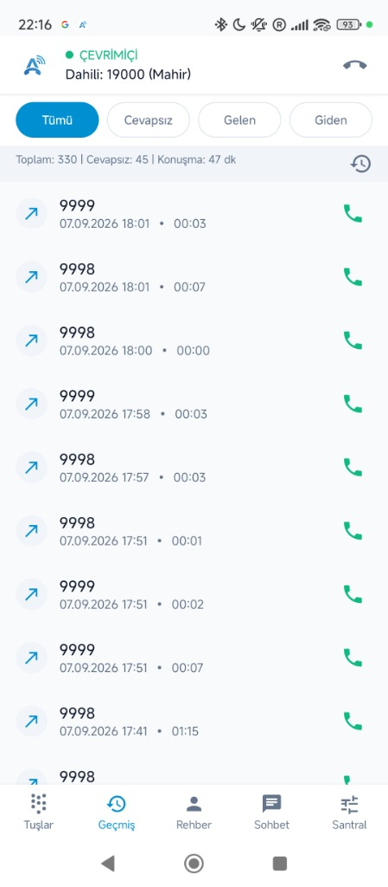
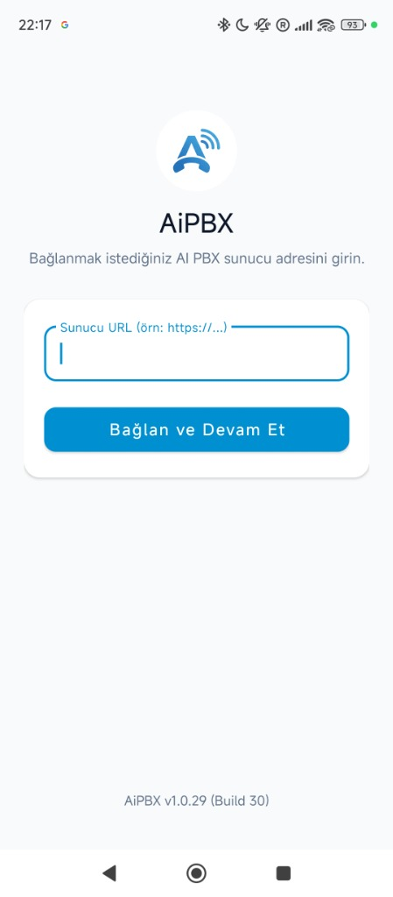

<p align="center">
  <a href="https://aipbx.bid">
    
  </a>
</p>

<h1 align="center">AI PBX</h1>

<p align="center">
  <strong>Open-Source Enterprise IP PBX Management Portal & Unified Communications</strong><br>
  Asterisk 22 · PHP 8 · MariaDB · WebRTC · Instant Messaging · Android & iOS Apps
</p>

<p align="center">
  📖 <a href="docs/README.md"><strong>Documentation</strong></a> · 🌐 <a href="https://aipbx.bid"><strong>Website: aipbx.bid</strong></a>
</p>

<p align="center">
  <a href="https://github.com/mahirgul/AiPBX/releases/latest"></a>
  <a href="https://github.com/mahirgul/AiPBX/blob/main/LICENSE"></a>
  
  
  
  
  <a href="docs/README.md"></a>
</p>

<p align="center">
  <a href="#quick-install">Quick Install</a> •
  <a href="#updating">Updating</a> •
  <a href="#features">Features</a> •
  <a href="docs/README.md">Documentation</a> •
  <a href="#architecture">Architecture</a> •
  <a href="CHANGELOG.md">Changelog</a> •
  <a href="docs/roadmap.md">Roadmap</a> •
  <a href="#contributing">Contributing</a>
</p>

---

## Quick Install

```bash
# One-liner installation (installs the latest release)
curl -fsSL https://raw.githubusercontent.com/mahirgul/AiPBX/main/install.sh | sudo bash
```

Or clone manually and install the latest release:

```bash
git clone https://github.com/mahirgul/AiPBX.git /opt/aipbx
cd /opt/aipbx
git checkout "$(git tag -l 'v*' --sort=-v:refname | head -1)"
sudo bash install.sh
```

The installer:
1. Asks for your **FQDN** — with Let's Encrypt if DNS points to the server, otherwise a self-signed
   certificate; leave it blank for a LAN-only install announced as `aipbx.local` via mDNS
2. Generates **strong random secrets** for every service (no default passwords)
3. Installs and configures Asterisk, MariaDB, Nginx + Apache, PHP, coturn, the Go chat service,
   firewalld and fail2ban, and builds the database from migrations
4. Prints the credentials and saves them to `/root/aipbx-credentials.txt`

> **Requirements**: Ubuntu 26.04 LTS · 2 GB RAM · 10 GB disk · root access
>
> Developers: `AIPBX_REF=main` installs the current development branch instead of the latest release.

After installing, open `https://<your-server>` and log in with the admin credentials shown.

---

## Updating

Releases are published as git tags (`vX.Y.Z`) with notes in [CHANGELOG.md](CHANGELOG.md).

```bash
sudo aipbx-update --check   # installed vs. latest release
sudo aipbx-update           # update to the latest release
```

Or from the portal: **Admin → System Update** (admin only) shows the installed and latest version, the
release notes and an **Update** button with live progress. A new release is also checked for every night.

Every update:
- refuses to start during active calls (Asterisk is restarted) or over hand-edited code;
- backs up the database, `/etc/ai-pbx.env` and `/etc/asterisk` to `/var/backups/aipbx/`;
- applies database migrations, new packages and system settings **without touching passwords,
  certificates, the admin password or your firewall choices**;
- verifies services, the portal and every page — and **rolls back automatically** (code, database
  and settings) if anything fails.

Keep customisations out of `/opt/aipbx` (use the portal, `/etc/ai-pbx.env` and `*_custom.conf`
files) so they survive updates. See [INSTALL.md](INSTALL.md) for details.

---

## Features

### 📞 PBX Management
- **Extension management** — PJSIP-based, one number on desk phone, browser and mobile at once
  (SIP + WebRTC + mobile endpoints)
- **Calling permission groups (call barring)** — prefix and exact-match rules (`0`, `05`, `00`),
  per-extension assignment, default allow-all
- **Voicemail** — Asterisk voicemail with unconditional / busy / no-answer / unavailable triggers,
  managed in *My Phone* or with feature codes (`*97` own mailbox, `*98` mailbox login), in-browser player
- **Boss – secretary groups** — executive interception, simultaneous or sequential secretary ringing,
  VIP whitelist bypass, automatic failover
- **Ring groups** — virtual numbers mixing extensions and external numbers, simultaneous or sequential
- **Conference rooms** — ConfBridge with PINs, wait-for-leader, join muted and live web moderation (mute/kick)
- **Trunks** — IP or registration based, tabbed settings, copy, rename and drag-and-drop ordering;
  inbound DID trimming, transit routing between PBXes and carriers, per-trunk **outbound caller ID
  normalization** (keep last N digits + prefix, e.g. extension `7840` → `903704187840`)
- **Outbound routes** — Asterisk patterns, strip/prepend, trunk failover chain, route groups for PBXes
  with different number formats, copy and ordering, duplicate patterns rejected
- **DID routing, time conditions, multi-level IVR**
- **Queues** — dynamic agent login/logout, static agents, hold music, recording
- **Feature codes** — `*81`/`*80` queue login/logout, `*72` call forward, `*60` DND, `*43` intercom,
  `*90`/`*91`/`*92` spy/whisper/barge, `*97`/`*98` voicemail
- **In-band disconnect supervision** — disconnect-tone detection for analog/legacy trunks
- **Safe apply** — generated configuration is reloaded atomically; a failed write or Asterisk reload is
  rolled back and the change stays pending
- **Live dashboard** — active calls and channels, callers waiting in queues, today's answered / missed
  calls and per-trunk channel usage, refreshed every 5 seconds
- **Complete Turkish prompt set** in one voice — every Asterisk core prompt plus voicemail, digits,
  conference, queue and directory prompts, so Turkish calls never switch to English halfway. Shipped
  as `asterisk-core-sounds-tr` packages in six formats (wav, ulaw, alaw, gsm and HD g722/sln16), so
  Asterisk plays the file matching the call's codec — and any Asterisk server can use them
- **Call recordings** — converted automatically to mono 16 kbps MP3 (~8× smaller than WAV), played in
  CDR reports, *My Phone* and the apps

### 📠 Fax
- **Inbound/outbound fax** — T.38 and G.711 (res_fax + SpanDSP)
- **Compose in the browser** (rich-text editor) or **upload a PDF**; resend failed faxes
- **E-mail notification** with the fax attached; per-DID recipients

### 📊 Call Center & Supervision
- **Agent desk and wallboard** — live queues, waiting callers (with pickup), agent states
  (idle / ringing / in call / on break), SLA, answered / missed / abandoned statistics
- **Breaks with reasons**, applied in Asterisk per queue, and break reports
- **Listen, whisper and barge** — from the wallboard or with `*90`/`*91`/`*92`
- **Call transfer** that keeps the caller connected through queue Local channels
- **Queue Report Centre** — service level, answered / lost calls, average wait and talk time per queue
  and per agent, lost calls with call-back tracking, repeat callers and call outcomes
- **Call reports and call journey** — calls grouped by linkedid with a step-by-step timeline; caller,
  inbound and outbound trunk, dialled number and direction (inbound / outbound / internal /
  trunk to trunk, transferred), recording playback with a waveform player
- **Branded PDF and Excel export** for every report, as filtered, with all rows

### 🌐 WebRTC Softphone
- **Browser phone** built into the portal header — no installation
- **TURNS (coturn)** relay for clients behind NAT and strict firewalls — clients use 443, which the
  nginx multiplexer hands to coturn (5349); per-user, time-limited credentials refreshed automatically
- **NAT handled in the generator** — public/private address mapping for ICE and every SIP transport;
  see [WebRTC, NAT and TURN](docs/webrtc-nat.md)
- **Opus + DTLS-SRTP** encrypted audio

### 💬 Messaging & Group Chat
- **1-to-1 and group chat** (Go WebSocket service `aipbx-chat`), group admins, member management
- **Photos and files** with thumbnails; access limited to the conversation's participants
- **Presence, typing indicators, read receipts**; push notifications on mobile

### 📱 Mobile Apps
- **Android** (Kotlin) — WebRTC calling with push wake-up and a foreground service, chat,
  directory with presence, call history, DND / call forward, in-app log viewer
- **iOS** (SwiftUI, CallKit) — calling with native incoming-call screen, chat, directory, features
- **Sign-in** with username + password (+ 2FA code), by scanning a QR code on the portal, or with the
  one-time link in the invitation e-mail

<p align="center">
  
  
  
  
  
</p>

### 🤖 AI
- **Cloud TTS** — turn text into speech with Google (API key or service account), Amazon Polly, Azure AI
  Speech, ElevenLabs or OpenAI; listen, download the MP3 or save it as an announcement in one click.
  Credentials are stored encrypted; usage is tracked per character

### 💼 Microsoft Teams Integration
- **Direct Routing** over SIP-TLS 5061 with SRTP
- **User ↔ extension mapping** (Microsoft 365 UPN, E.164)
- **Teams channel notifications** (missed calls, voicemail, queue alarms, faxes)
- **Generated PowerShell** setup scripts from your PBX configuration

### 🔐 Authentication & Security
- **Two-factor authentication (TOTP)** with offline QR codes and single-use recovery codes — enforced
  for portal, mobile and Google sign-in
- **Passkeys (WebAuthn / FIDO2)** — passwordless sign-in with biometrics or PIN
- **Google sign-in** (optional) with token audience and verified e-mail checks
- **Sessions revoked on password change** — mobile and chat tokens stop working immediately
- **User invitations** — generated passwords, forced first-login change, mobile sign-in link
- **RBAC** — built-in roles (admin, viewer, queue manager, agent, fax, **user** — the default) and custom
  roles with per-module permissions; security-critical pages are admin-only
- **Brute-force protection** — math CAPTCHA, account/IP lockout and a fail2ban jail using the real
  client address (PROXY protocol from the 443 edge)
- **Certificates page** — one certificate for portal, TURNS and SIP-TLS: Let's Encrypt (tested on
  staging first, renewed automatically), upload PEM or PFX/P12, or self-signed; problems that silently
  break WebRTC (self-signed, wrong name, missing chain) are flagged
- **Nightly backups** — database and configuration (`aipbx-backup`, 14 days, optional off-server copy)
- **Firewall and fail2ban management** from the portal through a single, argument-validated root
  helper (`aipbx-priv`) — the portal never runs arbitrary commands as root
- **Hardening** — CSRF tokens, security headers, sandboxed uploaded files, Asterisk HTTP on loopback,
  Apache kept in Ubuntu's systemd sandbox with only the paths the portal needs opened

### 🌍 Multi-language
- Turkish 🇹🇷 and English 🇬🇧 (2,000+ keys, parity checked in CI)

---

## Architecture

```
Internet ──443──▶ nginx (stream, ALPN, PROXY protocol)
                    ├─ HTTPS / WSS ──▶ Apache + PHP (127.0.0.1:8443)
                    │                    ├─ /ws       ──▶ Asterisk WebSocket (127.0.0.1:8088)
                    │                    └─ /chat/…   ──▶ aipbx-chat (127.0.0.1:8086)
                    └─ TURNS ─────────▶ coturn
         ──5060/5061, RTP──▶ Asterisk 22 (PJSIP)  ──ODBC──▶ MariaDB (CDR, queue_log)
```

```
AiPBX/
├── web/                    # PHP MVC portal
│   ├── src/
│   │   ├── controllers/    # 53 page controllers
│   │   ├── services/       # 45 services (business logic)
│   │   ├── repositories/   # 33 repositories
│   │   └── sync/           # 19 Asterisk configuration generators
│   ├── templates/          # layouts + 51 views
│   ├── api/                # JSON endpoints (call control, mobile, chat token, WebAuthn…)
│   ├── lang/               # tr / en
│   ├── db/migrations/      # Phinx migrations (the database schema)
│   └── tests/              # PHPUnit
├── chat/                   # Go WebSocket chat service
├── android/                # Kotlin app
├── ios/                    # SwiftUI app
├── asterisk-config/        # Asterisk base configuration
├── sounds/                 # bundled custom sounds + Turkish prompt texts (core-sounds-tr.txt)
├── asterisk-core-sounds-tr-*.tar.xz  # Turkish prompts, one package per format (+ SHA256SUMS)
├── docs/                   # administrator documentation
├── conf/sbin/              # aipbx-priv (root helper), aipbx-update (updater)
├── db/seed.sql             # initial roles, permissions, settings
├── scripts/release.sh      # publishes a release
├── install.sh              # installer (--upgrade mode used by aipbx-update)
├── VERSION · CHANGELOG.md
└── README.md · INSTALL.md · ARCHITECTURE.md
```

### Technology Stack

| Layer | Technology |
|-------|-----------|
| PBX | Asterisk 22 (PJSIP, res_fax, AMI, ODBC) |
| Web | PHP 8, MVC, Composer; vanilla JS + CSS |
| Database | MariaDB (Phinx migrations) |
| Edge | nginx stream on 443 (ALPN + PROXY protocol) → Apache |
| Chat | Go + gorilla/websocket |
| WebRTC | coturn TURN/STUN, DTLS-SRTP, Opus |
| Android | Kotlin, WebRTC, FCM |
| iOS | Swift, SwiftUI, CallKit |
| CI | GitHub Actions: PHPStan, PHPUnit, page smoke tests, Go tests, Android/iOS builds |

---

## After Installing

- Credentials are in `/root/aipbx-credentials.txt` — note them and delete the file.
- Service secrets live in `/etc/ai-pbx.env`.
- To switch a self-signed install to a Let's Encrypt or your own certificate, use **Security → Certificates** — see [docs/certificates.md](docs/certificates.md).
- Ports and updating: [INSTALL.md](INSTALL.md).
- Set an e-mail relay (fax-to-e-mail, voicemail, invitations): [docs/mail.md](docs/mail.md).
- Configuring trunks, routes, roles and more: [documentation](docs/README.md).

---

## Contributing

Contributions are welcome — see [CONTRIBUTING.md](CONTRIBUTING.md) for code style, commit conventions
and testing.

1. Fork the repository
2. Create a feature branch (`git checkout -b feat/my-feature`)
3. Commit your changes (`git commit -m 'feat: add awesome feature'`)
4. Push the branch and open a Pull Request

Code comments, commit messages and documentation are written in English.

---

## License

[MIT License](LICENSE).

---

## Author & Creator

**Mahir Gül** · [mhrgl.com](https://mhrgl.com) · [@mahirgul](https://github.com/mahirgul)
