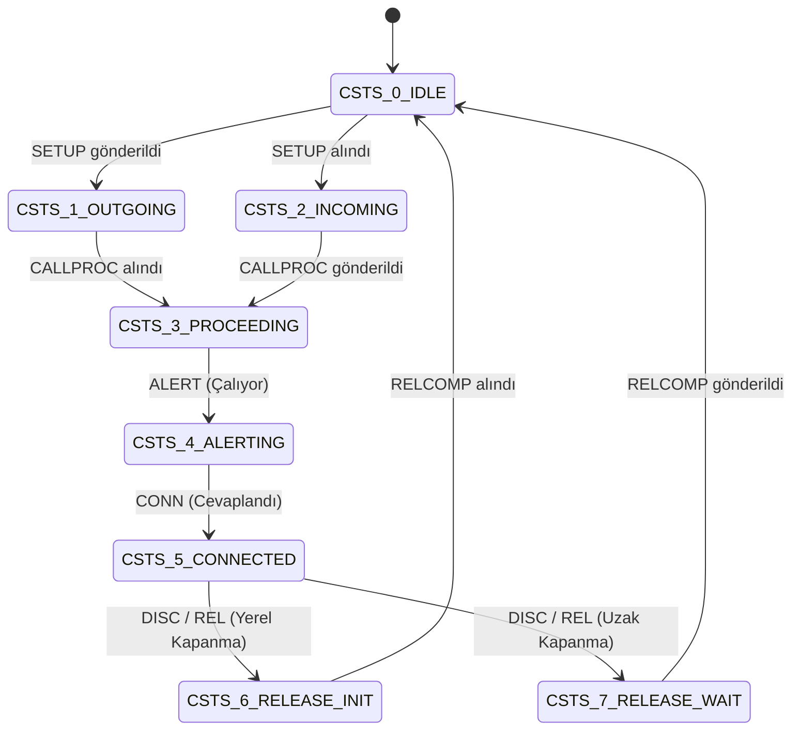

# NEC CCIS (Common Channel Interoffice Signaling) Protokol Analizi ve CCIS Gateway (ccisgw) Geliştirme Kılavuzu

Bu belge, **NEC UNIVERGE SV8300, SV8500 ve NEAX** santral ailelerinde kullanılan tescilli **CCIS (Common Channel Interoffice Signaling)** sinyalleşme protokolünün derinlemesine protokol katmanlarını, paket yapılarını (CCIS-MSU), çağrı durum makinelerini (CSTS) ve modern VoIP / Asterisk sistemleriyle sorunsuz haberleşen sağlam bir **CCIS Gateway (ccisgw)** mimarisinin nasıl inşa edileceğini açıklamaktadır.

---

## 1. CCIS Protokolünün Temel Mimarisi ve Katmanları

CCIS, NEC tarafından santraller arası kurumsal şebeke oluşturmak (özellik şeffaflığı - feature transparency sağlamak) amacıyla ITU-T **SS7 No.7 / ISUP (ISDN User Part)** ve ITU-T **Q.931 (ISDN DSS1)** protokolleri harmanlanarak geliştirilmiş hibrit bir sinyalleşme sistemidir.

### 1.1. Ağ Topolojisi ve Temel Kavramlar

```
+-----------------------------------+                     +-----------------------------------+
|      NEC PBX (Node A / OPC)       |                     |      NEC PBX (Node B / DPC)       |
|                                   |                     |                                   |
|  [Voice Channel 1 (B1)] ========> | === Bearer Path ==> | ====> [Voice Channel 1 (B1)]      |
|  [Voice Channel 2 (B2)] ========> |    (TDM / RTP)      | ====> [Voice Channel 2 (B2)]      |
|  [Voice Channel N (Bn)] ========> |                     | ====> [Voice Channel N (Bn)]      |
|                                   |                     |                                   |
|  [Common Channel (CCH)] <-------> | <-- CCIS-MSU Link-> | <---> [Common Channel (CCH)]      |
|                                   |    (HDLC / TCP/IP)  |                                   |
+-----------------------------------+                     +-----------------------------------+
```

* **Signaling Point (SP):** Ağdaki her santral bir sinyalleşme noktasıdır.
* **Point Code (PC / FPC):** Santralin benzersiz kimlik numarasıdır (Originating Point Code - OPC, Destination Point Code - DPC, Fusion Point Code - FPC: 1 - 253).
* **Common Channel (CCH / FCCH):** Ses kanallarından bağımsız olarak ayrılmış ortak sinyalleşme kanalıdır (TDM'de Timeslot 16/24, IP ortamında TCP/UDP soketi).
* **CIC (Circuit Identification Code):** Sinyalin hangi ses kanalına (B-channel veya RTP portu) ait olduğunu belirten 12-bit / 16-bit devre kodudur (CIC 1, CIC 2, ...).

### 1.2. CCIS İletim Türleri

1. **TDM-CCIS:** E1/PRI (2.048 Mbps) veya T1 (1.544 Mbps) üzerinden taşınır. 16. veya 24. kanal DTI/CCH kartı üzerinden Katman 2 HDLC çerçeveleme ile sinyal iletir.
2. **IP-CCIS (CCIS over IP / Peer-to-Peer):** TDM kartı olmaksızın, CCIS-MSU mesajlarının doğrudan IP soketleri üzerinden aktarılmasıdır (SV8300'de DRS/xscb, SV8500'de PHC paket kontrolörü).
3. **S-CCIS (SIP-CCIS / SCCIS):** CCIS-MSU mesajlarının SIP mesajları (`INVITE`, `INFO`, `NOTIFY`, `BYE`) içerisine `Content-Type: CCIS-MSU` veya özel SIP başlıkları olarak gömülmesidir (SIP Tunneling).

---

## 2. Protokol Katmanları ve Paket Formatı (CCIS-MSU)

### 2.1. Katman 2 (Data Link / CCH Framing)

Katman 2 seviyesinde bağlantı denetimi ve veri güvenliği sağlanır:

* **Sinyalleşme Başlığı:**
  * `Frame Sync / Delimiter`: Başlangıç baytı (`0x7E` veya NEC özel L2 belirteci)
  * `Length Indicator (LI)`: Takip eden paketin bayt uzunluğu
  * `Sequence Numbers`: İleri ve geri sıra numaraları (FSN / BSN)
  * `Checksum`: Başlık ve yük doğrulaması (`L2 HADER CHECKSUM`)
* **L2 Durum ve Zaman Aşımları:**
  * `L2 HEADER RECEIVE WAIT T.O`: Karşı taraftan L2 başlığı alınırken zaman aşımı.
  * `KEEP ALIVE`: Bağlantıyı canlı tutma periyodu.
  * `CONNECTION T.O 1 / 2`: Soket bağlantı zaman aşımları.
  * `CCH LINK CHANGEOVER / CHANGEBACK`: Link arızalandığında yedek hatta geçiş ve geri dönüş.

### 2.2. Katman 3 Sinyalleşme Birimi (CCIS-MSU Header)

Her CCIS-MSU (Message Signaling Unit) paketi bir **Routing Label (Yönlendirme Etiketi)** ile başlar:

```text
+-----------------------+-----------------------+-----------------------+
|  DPC (14/16 bit)      |  OPC (14/16 bit)      |  SLS (4 bit)          |
|  Destination Point    |  Originating Point    |  Signaling Link       |
+-----------------------+-----------------------+-----------------------+
|  CIC (12/16 bit)                              |  Message Type (8 bit) |
|  Circuit Identification Code (Ses Devresi)    |  SETUP, CONN, REL...  |
+-----------------------------------------------+-----------------------+
|  Mandatory & Optional Parameters (Information Elements - IEs)         |
|  - Calling Party Number (Arayan Numara)                               |
|  - Called Party Number (Aranan Numara)                                |
|  - Calling Party Name (Arayan İsim)                                   |
|  - Bearer Capability (Ses/Veri Tercihi)                               |
|  - Cause Value (Q.850 Hata/Ayrılma Kodu)                              |
+-----------------------------------------------------------------------+
```

### 2.3. Mesaj Tipleri (Message Types) ve Eşdeğerleri

Firmware tersine mühendisliğinde (`_causQ931Edit.c` ve `MPCDE0.bin`) doğrulanan mesaj türleri:

| Mesaj Adı | Hex Kodu (Tipik) | Q.931 Eşdeğeri | ISUP Eşdeğeri | Açıklama |
| :--- | :--- | :--- | :--- | :--- |
| **`SETUP`** | `0x05` | `SETUP` | `IAM` | Çağrı başlatma, numara ve CIC tahsisi |
| **`CALLPROC`** | `0x02` | `CALL PROCEEDING`| `SAM` / `ACM` | Numara alındı, çağrı işleniyor |
| **`ALERT`** | `0x01` | `ALERTING` | `ACM` (Alerting) | Karşı tarafın telefonu çalıyor |
| **`CONN`** | `0x07` | `CONNECT` | `ANM` | Çağrı cevaplandı, konuşma başladı |
| **`PROGRESS`** | `0x03` | `PROGRESS` | `CPG` | Erken medya veya çağrı ilerleme bildirimi |
| **`DISC`** | `0x45` | `DISCONNECT` | - | Abone ahizeyi kapattı (İlk ayrılma) |
| **`REL`** | `0x4D` | `RELEASE` | `REL` | Devrenin serbest bırakılması talebi |
| **`RELCOMP`** | `0x5A` | `RELEASE COMPLETE`| `RLC` | Devrenin boşaltıldığı teyidi |
| **`SUS`** | `0x61` | `SUSPEND` | `SUS` | Bekletmeye alma (Hold) |
| **`RES`** | `0x65` | `RESUME` | `RES` | Beklemeden çıkarma (Retrieve) |
| **`INFO`** | `0x7B` | `INFORMATION` | `INF` | Ek hane, DTMF veya servis parametresi |

---

## 3. Çağrı Durum Makinesi (Call State Machine - CSTS)

NEC sisteminde çağrı devreleri `CSTS` (Call State) durumlarına göre işletilir:



* **CSTS 0 (IDLE):** Devre boşta. Yeni arama kabul edebilir veya başlatabilir.
* **CSTS 1 (OUTGOING SEIZURE):** Yerel santral devreyi kilitledi, karşı tarafa `SETUP` gönderdi.
* **CSTS 2 (INCOMING SEIZURE):** Karşıdan `SETUP` geldi, yerel kaynaklar aranıyor.
* **CSTS 3 (CALL PROCEEDING):** Numara doğrulandı, rota kuruluyor.
* **CSTS 4 (ALERTING):** Hedef abone çalıyor (Zil sesi üretiliyor).
* **CSTS 5 (CONNECTED / TALKING):** Çağrı bağlandı. İki yönlü ses/RTP devrede.
* **CSTS 6 (RELEASE INITIATED):** Çağrıyı yerel taraf sonlandırdı, `REL` gönderildi, `RELCOMP` bekleniyor.
* **CSTS 7 (RELEASE WAIT):** Karşı taraf kapattı, `REL` geldi, kaynaklar boşaltılıp `RELCOMP` dönülecek.

> [!WARNING]
> **CSTS Uyuşmazlığı (`CSTS UNMATCH` / `CSTS ERR 1..7`):**
> Eğer Gateway ile NEC PBX aynı anda aynı CIC kanalını kapmaya çalışırsa (**Dual Seizure / Glare**) veya bir taraf hattı kapattığı halde diğer taraf CSTS 5'te kalırsa uyuşmazlık oluşur. Gateway'in Glare durumunda Point Code önceliğine göre devreyi bırakıp başka CIC'ye geçmesi şarttır.

---

## 4. SIP-CCIS (S-CCIS) ve Asterisk Dönüşüm Tablosu

Bir CCIS Gateway geliştirirken en pratik ve modern yöntem **S-CCIS (SIP-CCIS)** veya **Doğrudan SIP Kapsülleme** kullanmaktır. SIP ile CCIS arasındaki birebir haritalama:

| SIP Mesajı | Yön | CCIS-MSU Mesajı | Taşınan Parametreler |
| :--- | :---: | :--- | :--- |
| **`INVITE` (SDP)** | $\rightarrow$ | **`SETUP`** | Arayan No, Aranan No, Arayan İsim, CIC, RTP IP/Port |
| **`100 Trying`** | $\leftarrow$ | **`CALLPROC`** | İşlem sürüyor teyidi |
| **`180 Ringing`** | $\leftarrow$ | **`ALERT`** | Erken zil / çaldırma bildirimi |
| **`183 Session Progress`** | $\leftarrow$ | **`PROGRESS`** | Erken medya (Anons / Özel tonlar) |
| **`200 OK` (SDP)** | $\leftarrow$ | **`CONN`** | Cevaplama, ses kanalı aktif, fatura başlangıcı |
| **`ACK`** | $\rightarrow$ | *(İç Bağlantı Onayı)* | Medya akışı kesinleşti |
| **`BYE`** | $\rightarrow$ | **`REL`** | `Reason: Q.850; cause=16`, Devre serbest bırakma |
| **`200 OK` (BYE için)** | $\leftarrow$ | **`RELCOMP`** | CIC havuzuna iade edildi |
| **`CANCEL`** | $\rightarrow$ | **`REL`** | `Reason: Q.850; cause=16`, Cevapsız iptal |
| **`INFO` / `NOTIFY`** | $\leftrightarrow$ | **`INFO`** | İsim güncelleme, MWI, DTMF (RFC 2833) |

---

## 5. Sağlam Bir CCIS Gateway (ccisgw) Mimari Tasarımı

Güvenilir, kesintisiz çalışan bir `ccisgw` yazılımı 5 temel çekirdek bileşenden oluşmalıdır:

```
+-------------------------------------------------------------------------------+
|                            CCIS GATEWAY (ccisgw)                              |
+-------------------------------------------------------------------------------+
|                                                                               |
|  +--------------------+   +-----------------------+   +--------------------+  |
|  |     SIP Core       |   |   Translation Engine  |   |    CCIS Core       |  |
|  |   (PJSIP / Sofia)  |   |                       |   |    (L2/L3 Stack)   |  |
|  |                    |   |  - SIP <-> CCIS-MSU   |   |                    |  |
|  |  - RFC 3261 Stack  | <-> - CID/DNIS Eşleme     | <-> - MSU Parser/Build |  |
|  |  - SDP Müzakeresi  |   |  - Q.850 Sebep Çevrimi|   |  - FPC / Routing   |  |
|  |  - RTP Yönetimi    |   |  - Name Transcoding   |   |  - Soket Denetimi  |  |
|  +--------------------+   +-----------------------+   +--------------------+  |
|                                       ^                          ^            |
|                                       |                          |            |
|                           +-----------------------+              |            |
|                           |  CIC Pool & Glare Mng |              |            |
|                           |  - Kanal Tahsisi      |              |            |
|                           |  - Glare Resolution   |              |            |
|                           |  - CSTS Durum Takibi  |              |            |
|                           +-----------------------+              |            |
|                                                                  v            |
|                                                       +--------------------+  |
|                                                       | Keepalive & Guard  |  |
|                                                       | - Heartbeat Ping   |  |
|                                                       | - Link Failover    |  |
|                                                       | - Inactivity Timer |  |
|                                                       +--------------------+  |
+-------------------------------------------------------------------------------+
```

### 5.1. Devre (CIC) Yönetimi ve Glare Çözümü

* **Kanal Havuzu:** Santral ile gateway arasında kaç ses kanalı tanımlıysa (örn. 30 kanal), Gateway bu kanalları bir bitmask veya dizi içinde tutar (`FREE`, `BUSY`, `BLOCKED`).
* **Seçim Stratejisi:**
  * **Asterisk'ten NEC'e giden aramalarda:** En küçük numaralı boş CIC'den başla (Ascending: 1, 2, 3...).
  * **NEC'ten gelen aramalarda:** PBX genellikle en büyükten başlar (Descending: 30, 29, 28...).
  * Bu yöntem çakışma (Glare) ihtimalini %95 azaltır.
* **Glare Durumu:** Eğer iki taraf da aynı milisaniyede CIC 5'i kaparsa; Point Code'u büyük olan taraf devreyi alır, küçük olan taraf çağrısını derhal sıradaki boş CIC'ye aktarır.

### 5.2. Link Denetimi ve Bekçi (Watchdog) Mekanizması

* **Soket Canlı Tutma:** Karşı tarafa her 5-10 saniyede bir `KEEP ALIVE` veya `Sync-req` paketi gönderilmelidir.
* **Kurtarma:** 2 periyot boyunca yanıt gelmezse (`CONNECTION T.O 2`):
  1. Soket kapatılır (`closesocket`).
  2. Tüm aktif CIC'ler `FORCE_IDLE` durumuna çekilir (Asterisk tarafındaki çağrılar `Congestion` ile sonlandırılır).
  3. Yeniden bağlantı (`reconnect`) başlatılır.

---

## 6. Referans CCIS-MSU Ayrıştırıcı ve İskelet Kod (Python)

Aşağıdaki referans kod, CCIS-MSU paketlerini ikili (binary) düzeyde ayrıştıran ve oluşturan çekirdek kütüphane prototipidir:

```python
import struct

# CCIS Mesaj Türü Sabitleri
CCIS_MSG_SETUP    = 0x05
CCIS_MSG_CALLPROC = 0x02
CCIS_MSG_ALERT    = 0x01
CCIS_MSG_CONN     = 0x07
CCIS_MSG_PROGRESS = 0x03
CCIS_MSG_DISC     = 0x45
CCIS_MSG_REL      = 0x4D
CCIS_MSG_RELCOMP  = 0x5A
CCIS_MSG_INFO     = 0x7B

# Bilgi Elemanı (IE) Tanımları
IE_CALLING_NUMBER = 0x01
IE_CALLED_NUMBER  = 0x02
IE_CALLING_NAME   = 0x03
IE_BEARER_CAP     = 0x04
IE_CAUSE          = 0x08

class CcisMsuPacket:
    def __init__(self, opc=0, dpc=0, cic=0, msg_type=0):
        self.opc = opc          # Originating Point Code (Arayan Santral)
        self.dpc = dpc          # Destination Point Code (Hedef Santral)
        self.cic = cic          # Circuit Identification Code (Ses Devresi)
        self.msg_type = msg_type
        self.params = {}        # Bilgi Elemanları (IEs)

    def pack(self) -> bytes:
        """CCIS-MSU İkili Çerçevesini Oluşturur"""
        # 1. Routing Label (8 bayt)
        # OPC (16-bit), DPC (16-bit), CIC (16-bit), MsgType (8-bit), Reserved (8-bit)
        header = struct.pack(">HHHBB", self.opc, self.dpc, self.cic, self.msg_type, 0x00)
        
        # 2. Parametre Yükü (Information Elements)
        body = bytearray()
        for ie_type, ie_val in self.params.items():
            if isinstance(ie_val, str):
                val_bytes = ie_val.encode('latin1')
            elif isinstance(ie_val, int):
                val_bytes = bytes([ie_val])
            else:
                val_bytes = bytes(ie_val)
            # TLV Formatı: Tag (1B), Length (1B), Value (NB)
            body.append(ie_type)
            body.append(len(val_bytes))
            body.extend(val_bytes)
            
        # 3. L2 Çerçeve Başlığı: Uzunluk ve Başlık Türü
        l2_len = len(header) + len(body)
        l2_header = struct.pack(">H", l2_len)
        return l2_header + header + bytes(body)

    @classmethod
    def unpack(cls, data: bytes):
        """Gelen İkili Bayt Akışını CCIS-MSU Nesnesine Çözer"""
        if len(data) < 10:
            return None
        l2_len = struct.unpack(">H", data[0:2])[0]
        opc, dpc, cic, msg_type, _ = struct.unpack(">HHHBB", data[2:10])
        
        pkt = cls(opc=opc, dpc=dpc, cic=cic, msg_type=msg_type)
        pos = 10
        total_len = min(len(data), 2 + l2_len)
        while pos + 2 <= total_len:
            ie_type = data[pos]
            ie_len = data[pos + 1]
            pos += 2
            if pos + ie_len <= total_len:
                val = data[pos:pos + ie_len]
                pkt.params[ie_type] = val
                pos += ie_len
            else:
                break
        return pkt
```

---

## 7. Sonuç ve ccisgw Geliştirme Yol Haritası

1. **Adım 1 - Transport Katmanı:** Gateway için TCP/UDP üzerinden NEC PHC/DRS soket protokolüne bağlanan ve `Sync-req` / `KEEP ALIVE` ile linki sürekli yeşil tutan bir bağlantı sürücüsü yazılmalıdır.
2. **Adım 2 - CIC Havuzu:** Asterisk ile paylaşılan 30/60/120 kanallı dinamik bir CIC yöneticisi kurulmalıdır.
3. **Adım 3 - SIP Köprüsü:** Asterisk chan_pjsip üzerinden gelen `INVITE` paketini CCIS `SETUP` paketine, NEC'ten gelen `ALERT`/`CONN` paketlerini ise SIP `180 Ringing`/`200 OK` yanıtlarına dönüştüren yönlendirme motoru devreye alınmalıdır.
4. **Adım 4 - Ses Yolu:** Çağrı kurulduğunda Asterisk RTP akışı ile NEC'in tayin ettiği IP/Port doğrudan ses geçişine (Direct Media / RTP Proxy) bağlanmalıdır.
